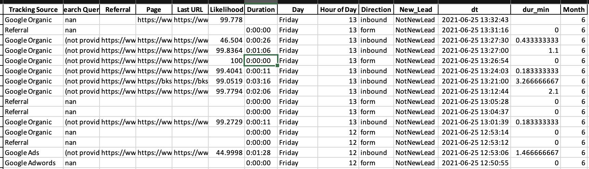
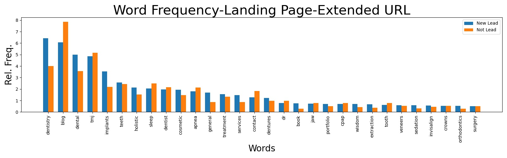
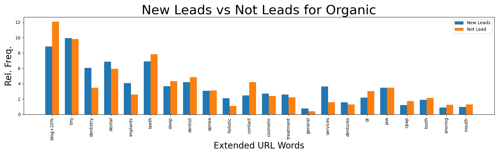
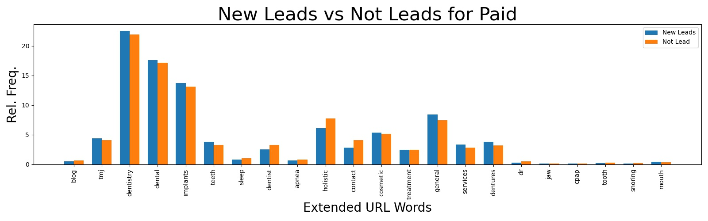
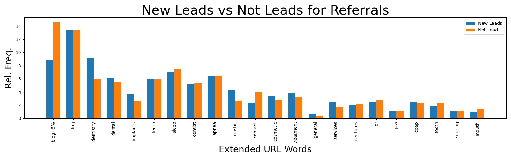
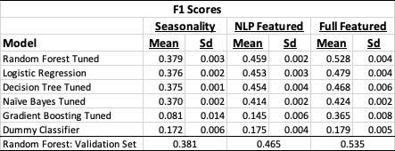
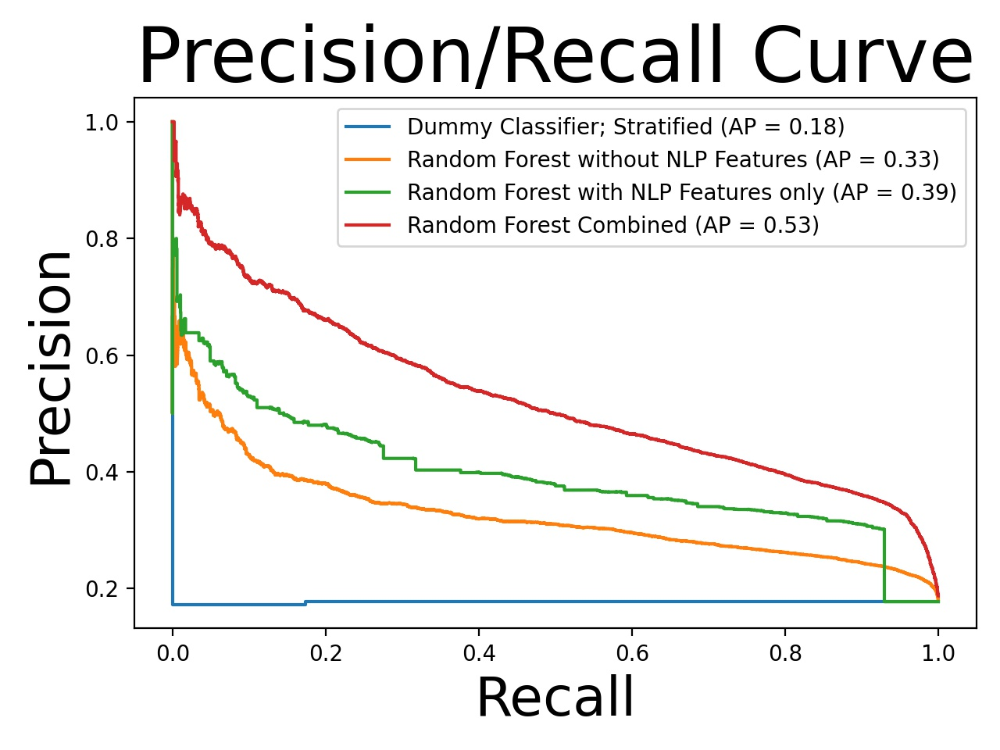
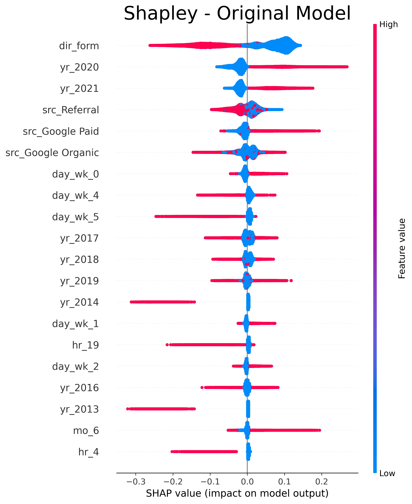
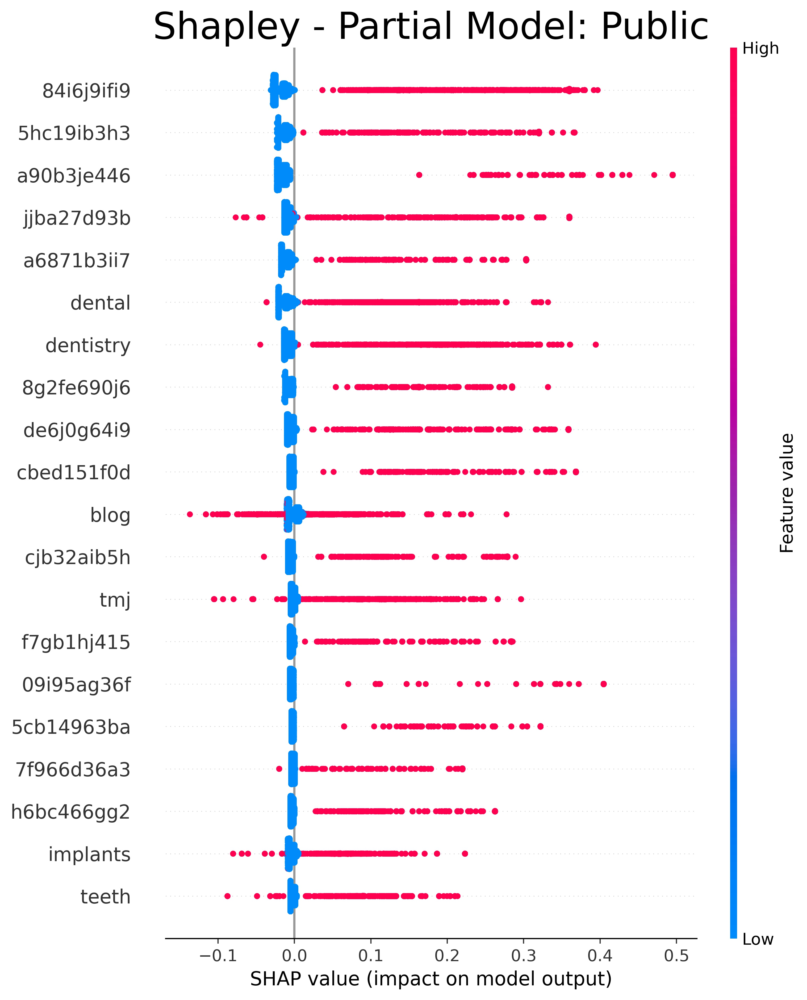
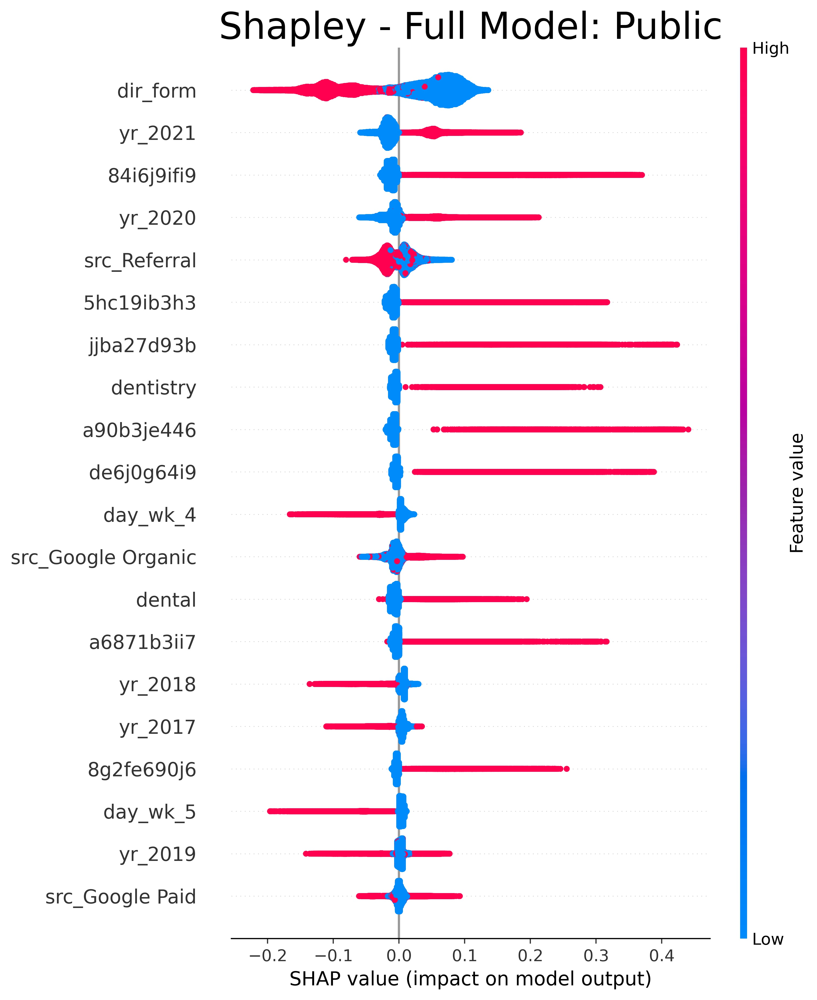

# Textual Analysis of New Leads

The purpose of this project is to perform a textual analysis of New Leads for Reynholm Industries, a stand-in name to help protect the confidentiality of the company that provided the data. Reynholm Industries is a marketing firm in the Mideastern United States that provides marketing for companies across the Continental United States. Reynholm Industries would like to enhance their ability to capture New Leads from their many marketing campaigns. To do so, the company provided this Data Scientist with a dataset to derive insights on maximizing New Leads. 

## Data

>The original data comprised just over 172 thousand rows with 46 columns, which spanned the years 2012 through part of 2021. Four of the columns were unnamed. Most of the columns were too sparse to include in an analysis, so the derived dataset had 13 columns. The four unnamed columns contain text that was combined into a single column, “combined’, that was used to derive two new columns: the dependent variable – “New Leads,” and a feature of interest to the client in a separate analysis called “Hang_Voice”. Confidential client information was given random names to protect confidentiality.

New_Lead is an indicator column of whether the combined column contained text indicating whether the row was a new lead or not. Hang_Voice is an indicator column of whether the combined column contained text indicating whether the row indicated that the contact resulted in a hang-up or a voicemail. Features “Date” and “Time” were combined into a column called “dt” that became a date-time indicator column. This column was used to derive seasonality predictors for hour, day of week, day of month, month, and year. 

>“Tracking Source”, the source of an ad that was clicked, was reduced to the three major categories: “Google Paid,” “Google Organic” and “Referral”.  Finally, there are four textual fields potentially of interest: “Search Query”, “Referral”, “Page,” and “Last URL”. Of these, the subject matter expert at Reynholm Industries expressed an interest in the “Search String” and Landing “Page”. The Landing “Page” is of interest for its textual contrast between domain name, extended portion of the URL, and the home page vs. New Leads. 

## Methods

For this project, a natural language analysis of the Landing Page URL components: the Domain name, extended URL, and search string was performed. Features were engineered from the NLP analysis and then 5 supervised learning models were fit including: Logistic Regression, Random Forest, Decision Tree, Naïve Bayes, and Gradient Boosting. Each model was tuned using a random grid search with five-fold cross validation. The final models were then compared. The best model was then used for fitting on the full training dataset with the tuned parameters. The model was then validated/tested using a holdout set. Feature importance’s were derived using Shapley values. 
The process was repeated for a full model that combined the features from the textual NLP analysis and a prior categorical/seasonality analysis, including the feature importance step and controlling for year. 

## Exploratory Data Analysis

>Exploratory data analysis consists of word frequencies for the components of the Landing Page URL that were not found to contain predominantly confidential information, namely, the extended URL. The difference in relative frequency of the dominant words in the extended URL show that the terms: “dentistry”, “blog”, “dental,” “tmj,” “implants” and “holistic” are expected to be important to a supervised model when predicting New Leads. Consider Figure 1. 

An examination of the three plots that show word frequencies for New Leads split by Tracking Source categories: Google Organic, Google Paid and Referral show that the various levels of Tracking Source may be important. 

## Model Results

>Models can be judged by several scoring metrics, such as accuracy, root-mean-squared-error (RMSE), area under the ROC curve (AUC), recall and precision among others. There are pros and cons to each metric, and data scientists must carefully weigh the consequences of choosing a metric. F1 was chosen here as it balances the influence of precision and recall, where both precision and recall are good choices for unbalanced data. However, no a-priori preference could be drawn to prefer precision over recall, or visa-versa, so their harmonic mean, or the F1 score, was chosen. The table below summarizes the model performance according to the F1 scores.

In each case, Random Forest had the best mean cross validated F1 score and was chosen for further fitting. The Dummy Classifier in all versions was well behind the Random Forest model, indicating model performance gains over the base model. We can see that the NLP featured model improved upon the seasonality model by almost 8%. Their combined model improved the F1 score by a further ~7%. On the testing set, the predictions from the Random Forest Classifier performed comparable to the set from which it was trained.

### Precision Recall Analysis

>Condiser the Precision Recall curve, displayed below. The curves bowed farther to the right are better models. Notice that the combined model out performs the other two models. 

## Feature Importance

>Feature importance and direction of effect was garnered with Shapley values. Year was included in the models to control for the clear powerful outlier effects of 2020 and 2021 on New Leads. 
For the original model, controlling for the effects of 2021, 2020, and 2019, seasonality because of Monday, Tuesday and Wednesday, and the month of June turn out to be the important factors for New Leads when only looking at seasonality and ad tracking source. This aligns with EDA showing that the beginning of the week is associated with greater counts of New Leads. If business can focus their efforts for converting New Leads early in the week, they could free up resources for later in the week for other tasks. 

For the NLP factored model, all the factors in the top 20 Shapley values summary plot are important for New Leads, with “dental,” “dentistry,” “blog,” “tmj,” “implants,” and “teeth” being the non-confidential fields contributed from the extended URLs, which were predicted to be important from EDA. I additionally predicted “holistic” would show up based on EDA and did not. 

>For the full model that included both Seasonality and NLP factors, 2021, 2020, keywords “dentistry” and “dental” from the extended URL; along with “Google Organic” and “Google Paid” ads, and landing on 7 of the top performing domains, regardless of the extended URL, were positive predictors of New Leads. Thursday and Friday are on the list as negative predictors of New Leads. 

No values from the search string demonstrated as important factors. Investigation shows that this is likely since there are under 200 search strings in the dataset associated with New Leads. 

## Business Findings
	 
>Findings mostly confirmed what SME suspected: Outliers, Fridays, Thursdays, Keywords. 

Future work may include finding ways to move google paid further to the right on impact on model output.

References

Lundberg, S.M., Erion, G., Chen, H. et al. From local explanations to global understanding with explainable AI for trees. Nat Mach Intell 2, 56–67 (2020). https://doi.org/10.1038/s42256-019-0138-9
